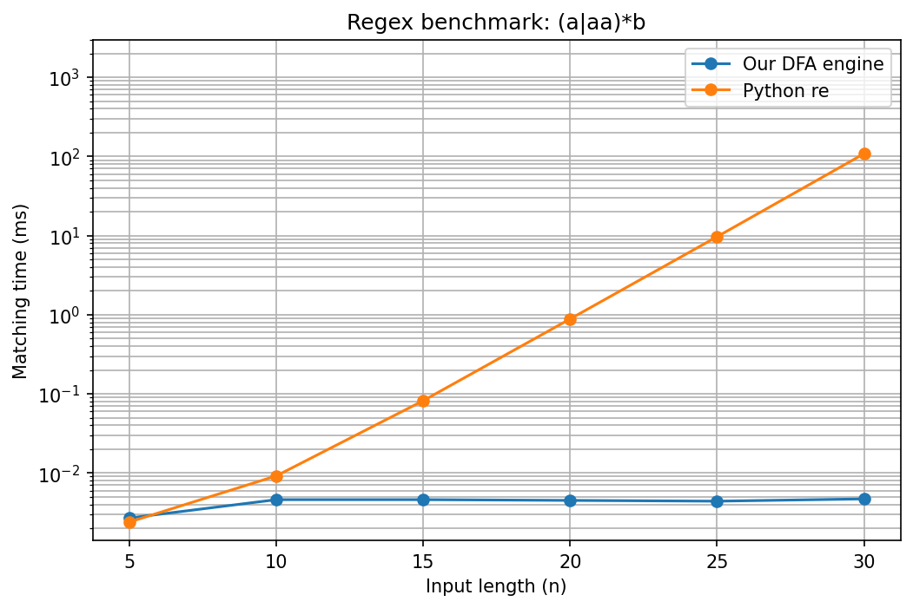

# Regex Engine from Scratch — Built on Automata Theory

A regex engine built from first principles using concepts from **formal languages and automata theory**.

The engine parses a regular expression into an **Abstract Syntax Tree (AST)**, constructs an **NFA using Thompson's construction**, converts it into a **DFA using subset construction**, minimizes the DFA using **Hopcroft's algorithm**, and finally performs matching using the minimized DFA.

The implementation does **not** use Python's `re` module or any third-party regex library for its actual matching logic.

The main goal of this project is to turn the theory behind regular expressions, NFAs, DFAs, and DFA minimization into a complete working system — while also exploring an important practical consequence of automata-based matching: resistance to **Regular Expression Denial of Service (ReDoS)** caused by catastrophic backtracking.

---

## Why this project?

Regular expressions are often taught as notation for describing patterns, but there is a lot of theory underneath them.

I built this project because I wanted to take the **Theory of Computation and automata concepts** I had learned and actually implement them from the ground up. Rather than treating regex, NFA, DFA, and minimization as purely theoretical concepts, I wanted to see how they come together to build a real working regex engine.

Most regex engines you use day to day (including Python's `re`) are backtracking engines. They're simple to implement but have a dangerous failure mode: certain pattern shapes, combined with certain inputs, cause the engine to explore an exponential number of possible paths before giving up.

There is also a practical reason for choosing this approach.

Backtracking regex engines can encounter patterns where a failed match causes them to explore a very large number of possible paths. For certain adversarial inputs, this can result in exponential matching time — a vulnerability class known as **ReDoS (Regular Expression Denial of Service)**.

For example:

```text
Pattern: (a+)+b
Input:   aaaaaaaaaaaaaaaaaaaaaaaaaaaaaaac
```

The input contains many possible ways for the nested `+` operators to partition the `a`s, but ultimately cannot match because the required `b` is missing.

An automata-based matcher avoids this backtracking behavior. Once the pattern has been compiled into a DFA, matching consists of following exactly one transition for each input character.

This project implements that approach and demonstrates the difference experimentally.

---

## The Pipeline

A regular expression passes through the following stages:

```text
"a(b|c)*d"
     │
     ▼
┌──────────────┐
│    Parser    │
└──────────────┘
     │
     │ regex → AST
     ▼
┌────────────────────────┐
│ Thompson's Construction │
└────────────────────────┘
     │
     │ AST → NFA
     ▼
┌────────────────────┐
│ Subset Construction │
└────────────────────┘
     │
     │ NFA → DFA
     ▼
┌──────────────────────┐
│ Hopcroft Minimization │
└──────────────────────┘
     │
     │ DFA → Minimal DFA
     ▼
┌──────────────┐
│    Matcher   │
└──────────────┘
     │
     │ one transition per character
     ▼
  True / False
```

### 1. Parsing — `parser.py`, `ast_nodes.py`

The engine begins with a **recursive-descent parser**.

The parser handles operator precedence so that:

* `|` has the lowest precedence
* concatenation comes next
* `*`, `+`, and `?` have the highest precedence

For example:

```text
a|bc*
```

is interpreted according to those precedence rules rather than simply from left to right.

The parser produces an Abstract Syntax Tree containing:

* `Literal`
* `Concat`
* `Union`
* `Star`
* `Plus`
* `Question`

Supported grouping with `(...)` is also handled by the parser.

---

### 2. NFA Construction — `nfa.py`

The AST is converted into an NFA using **Thompson's construction**.

Each AST node is translated into an NFA fragment consisting of a start state and an accept state.

#### Literal

```text
a
```

creates a transition labeled `a` between two states.

#### Concatenation

```text
XY
```

connects the accept state of `X` to the start state of `Y` using an ε-transition.

#### Union

```text
X|Y
```

creates ε-transitions from a new start state into both alternatives and connects both alternatives to a common accept state.

#### Star

```text
X*
```

allows:

* zero occurrences of `X`
* one occurrence
* multiple occurrences

through ε-transitions that allow both skipping and looping.

#### Plus

```text
X+
```

is similar to `X*`, but requires at least one occurrence.

#### Question

```text
X?
```

allows either zero or one occurrence.

The NFA also contains an `epsilon_closure()` operation, which finds every state reachable through ε-transitions without consuming input.

A direct NFA `simulate()` function is implemented as well. This provides a simple correctness reference for the later DFA stages.

---

### 3. DFA Construction — `dfa.py`

The NFA is converted into a DFA using **subset construction**.

A DFA state represents a complete set of NFA states that could be active at the same time.

For example:

```text
NFA states: {2, 5, 7}

        ↓

One DFA state representing:
"the NFA could currently be in 2, 5, or 7"
```

Each DFA state is ε-closed and represented internally using a `frozenset`.

The construction uses a worklist to discover reachable DFA states and computes deterministic transitions for every character in the alphabet.

The result is a deterministic transition table where each state and input character has at most one destination.

---

### 4. DFA Minimization — `minimize.py`

After subset construction, some DFA states may be equivalent — meaning that no possible future input can distinguish their behavior.

**Hopcroft's minimization algorithm** is used to identify and merge these equivalent states.

The implementation uses:

* partition refinement
* predecessor sets
* splitter states
* a worklist
* the smaller-half optimization used by Hopcroft's algorithm

The result is a smaller DFA that recognizes exactly the same language as the original DFA.

This step demonstrates another important automata-theory concept: two states can be represented separately internally while still being behaviorally equivalent and therefore safely merged.

---

### 5. Matching — `matcher.py`

The public API is provided through the `Regex` class:

```python
from regexlib.matcher import Regex

regex=Regex("a(b|c)*")

regex.match("ab")
regex.match("acbc")
```

Compilation happens once when the `Regex` object is created:

```text
Pattern
   ↓
Parser
   ↓
AST
   ↓
NFA
   ↓
DFA
   ↓
Minimal DFA
```

Subsequent calls to `.match()` simply walk the minimized DFA.

For an input of length `n`, matching performs one DFA transition per character, giving **O(n)** matching time after compilation.

There is no backtracking during matching.

> **Note:** `.match()` performs full-string matching, equivalent in behavior to Python's `re.fullmatch()`. It does not perform substring searching like `re.search()`.

---

# ReDoS Benchmark

One of the main practical motivations for the project is demonstrating the difference between DFA-based matching and catastrophic backtracking.

The benchmark compares this engine against Python's built-in `re` module using adversarial non-matching inputs.

Two patterns are tested:

```text
(a+)+b
(a|aa)*b
```

For each pattern, the input consists of increasing numbers of `a`s followed by `c`:

```text
"aaaa...aaac"
```

The final `c` ensures that the pattern does not match.

The benchmark uses a **2-second subprocess timeout** for Python's `re` so that an exponentially slow match cannot block the entire benchmark.

---

## Benchmark Results

### Pattern: `(a+)+b`

| Input length | This engine | Python `re` |
| -----------: | ----------: | ----------: |
|            5 |    0.004 ms |    0.005 ms |
|           10 |    0.012 ms |    0.054 ms |
|           15 |    0.011 ms |    1.573 ms |
|           20 |    0.007 ms |   50.716 ms |
|           25 |    0.008 ms | **TIMEOUT** |
|           30 |    0.008 ms | **TIMEOUT** |


---

### Pattern: `(a|aa)*b`

| Input length | This engine | Python `re` |
| -----------: | ----------: | ----------: |
|            5 |    0.003 ms |    0.004 ms |
|           10 |    0.006 ms |    0.015 ms |
|           15 |    0.009 ms |    0.136 ms |
|           20 |    0.006 ms |    1.531 ms |
|           25 |    0.009 ms |   18.083 ms |
|           30 |    0.012 ms |  196.560 ms |



The results show a clear difference in growth.

For `(a+)+b`, Python's `re` reaches approximately **50 ms at n=20** and exceeds the 2-second benchmark timeout before `n=25` completes.

The DFA-based engine remains below **0.02 ms** for every tested input.

For `(a|aa)*b`, Python's `re` grows from approximately **0.004 ms to 196 ms** across the tested range, while the DFA engine remains in the same small range.

The exact timings depend on the machine and runtime environment, but the difference in growth behavior is the important result.

---

# Why the Matcher Avoids Catastrophic Backtracking

The important point is that this behavior is not simply an optimization added to the matcher.

It follows from the structure of the algorithm.

### 1. Nondeterminism is resolved during compilation

Subset construction takes all possible NFA states that could be active and represents them as a single DFA state.

The branching possibilities are therefore handled while constructing the DFA rather than repeatedly during matching.

### 2. Matching does not backtrack

For every input character:

```text
current DFA state
       +
   input character
       ↓
one transition
       ↓
next DFA state
```

There is no mechanism for:

```text
try path A
   ↓
fail
   ↓
go back
   ↓
try path B
   ↓
fail
   ↓
...
```

because the matcher is operating on a deterministic automaton.

### 3. Matching is linear in input length

For an input containing `n` characters, the matcher performs one transition for each character.

Therefore:

```text
Matching complexity = O(n)
```

after the pattern has been compiled.

The compilation phase can be substantially more expensive than a single match and can produce a large DFA for some patterns. The O(n) guarantee specifically describes **matching after compilation**, not the cost of constructing the automaton.

---

# Automata-Based Matching vs Backtracking

This project also demonstrates an important trade-off.

A DFA-based engine provides predictable matching behavior for the regular-expression features it supports, but it cannot directly implement every feature found in general-purpose regex engines.

Features such as:

* backreferences
* lookaround
* other constructs requiring information about how a match was reached

go beyond the regular-language model used by this implementation.

This is one reason general-purpose regex engines offer more expressive features while automata-based engines can provide stronger guarantees for regular patterns.

---

# Supported Syntax

| Syntax | Meaning           |
| ------ | ----------------- |
| `a`    | Literal character |
| `ab`   | Concatenation     |
| `a\|b` | Union / OR        |
| `a*`   | Zero or more      |
| `a+`   | One or more       |
| `a?`   | Zero or one       |
| `(ab)` | Grouping          |

---

## Not Supported Yet

The current parser intentionally keeps the language small and focused on the core automata pipeline.

Not currently supported:

* Character classes such as `[a-z]`
* Bounded repetition such as `{n,m}`
* Escape sequences such as `\d` or `\.`
* Anchors such as `^` and `$`
* Backreferences
* Lookahead / lookbehind

The last two are outside the regular-language model used by this engine and therefore are not planned as part of the current automata-based implementation.

---

# Testing

The project contains tests for every major stage of the pipeline.

```text
tests/
├── test_parser.py
├── test_nfa.py
├── test_dfa.py
├── test_minimize.py
└── test_matcher.py
```

The testing strategy is deliberately based on **differential testing** wherever possible.

### Parser

`test_parser.py` verifies:

* literals
* concatenation
* union
* quantifiers
* grouping
* nested groups
* operator associativity
* invalid patterns

### NFA

`test_nfa.py` verifies the behavior of the NFA simulator against expected matches and rejects.

### DFA

`test_dfa.py` compares DFA matching against the already-tested NFA simulator using the same patterns and strings.

### Minimization

`test_minimize.py` compares the minimized DFA against the original DFA and also verifies that minimization does not increase the number of states.

A specific test also verifies that equivalent accepting states can be merged.

### Matcher

`test_matcher.py` tests the public `Regex` API, including:

* valid matches
* invalid strings
* empty-string behavior
* full-string matching semantics
* a ReDoS-style adversarial input

This creates a chain of validation:

```text
Parser
  ↓
NFA
  ↓
DFA
  ↓
Minimized DFA
  ↓
Public Matcher
```

so each major transformation can be checked against a previously validated representation.

---

# Project Structure

```text
regex-engine/
│
├── README.md
├── requirements.txt
│
├── regexlib/
│   ├── __init__.py
│   ├── ast_nodes.py
│   ├── parser.py
│   ├── nfa.py
│   ├── dfa.py
│   ├── minimize.py
│   └── matcher.py
│
├── tests/
│   ├── test_parser.py
│   ├── test_nfa.py
│   ├── test_dfa.py
│   ├── test_minimize.py
│   └── test_matcher.py
│
└── benchmarks/
    ├── redos_patterns.py
    ├── run_benchmark.py
    ├── plot_results.py
    ├── a__b_benchmark.png
    └── a_aastarb_benchmark.png
```

---

# Running the Project

Install the required dependencies:

```bash
pip install -r requirements.txt
```

### Run the test suite

From the project root:

```bash
pytest -v
```

### Run the benchmark

```bash
python benchmarks/run_benchmark.py
```

This prints the measured matching times for both implementations.

### Generate the graphs

```bash
python benchmarks/plot_results.py
```

The resulting benchmark images are saved inside the `benchmarks/` directory.

---

# Example

```python
from regexlib.matcher import Regex

regex=Regex("a(b|c)*d")

print(regex.match("ad"))
print(regex.match("abcd"))
print(regex.match("abcbcd"))
print(regex.match("abc"))
```

Output:

```text
True
True
True
False
```

The pattern is compiled into the automata pipeline once, and subsequent calls to `match()` operate directly on the resulting minimized DFA.

---

## What this project demonstrates

This project brings together several concepts from **Theory of Computation** and implements them as one working system:

* Regular expressions
* Recursive-descent parsing
* Abstract Syntax Trees
* ε-NFAs
* Thompson's construction
* ε-closure
* NFA simulation
* Subset construction
* DFAs
* DFA minimization
* Hopcroft's algorithm
* Deterministic linear-time matching
* ReDoS and catastrophic backtracking
* Differential testing
* Empirical performance benchmarking

The goal was not simply to reproduce regex matching, but to make the entire path from **regular expression → automaton → minimized automaton → matcher** explicit and executable.